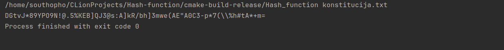
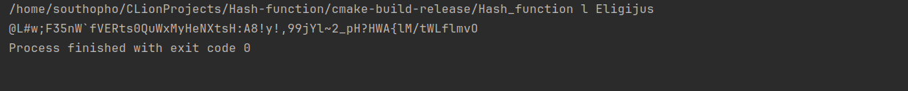

# Hash Function Laboratorinis Darbas be AI pagalbos

**Padarė:** Eligijus Alenčikas  
**Grupė:** 1 grupė, 1 pogrupis  
**Universitetas:** VU ISI

## Aprašymas

Šis projektas efektyviai įgyvendina hash funkciją, kuri atitinka visus reikalavimus:
- Deterministiškumas
- Avalanche effect (lavinos efektas)
- Negrįžtamumas
- Fiksuoto dydžio išvestis (64 simbolių)

## Algoritmo savybės

Hash funkcija atitinka visas iškeltas hash funkcijos savybes

### Algoritmo esmė žingsnis po žingsnio:

1. Hash funkcija gavus įvestį jo dįdį paverčia į 64 simbolių seką išemant paskutinius simbolius, bet tuo pačiu sujugenčius juos su pirmais simboliais.
2. Hash funkcija pradedant nuo įvesties pradžios paima simbolių porą, jas algoritmu sujungia į vieną simbolį ir pirmąjį poros simbolį pakeičia nauju sujungtu simboliu. Taip algoritmas tesiasi iki įvesties pabaigos.
3. Hasho algoritmas tą patį pakartoją, bet pradedant nuo įvesties pabaigos
4. Sugeneruotas Hashas išvedamas

## Eksperimentų rezultatai

## 1. Testinių failų rezultatai

test_1_char.txt (a):

```<rg(E|I4U<E*-\K@I"sF/8i^-&i@s|oJ),7`eH%D#\+"CL_xe~78e6U`q$q~k2;q```

test_1_char_b.txt (b):

```e'bIVsx5:eB_H7`q*u@kv}ZUNI^ILyPK6g@{heby6/J)|#Z+0!jE8{RI"%4eLa6.```

test_large.txt (L...):

```2-z"WnC'<^eOI5{jMF0+bHtZjl!2dfTt_&]?ShI~_`1sonah:?2I,h.fOlF6Ld$u```

test_large_modified.txt (v...):

```ls.0i6MMf<7q]WY")b"5Bz`\"<un"\P~s4GU{zk|14mm{ZOH2M^Ap8N8+PLl*N|S```

test_empty.txt:

Nėra rezultato, programa užlūžta

**Išvados:**
-  Visi hash'ai yra tiksliai 64 simboliai (64 baitai)
-  Mažas pokytis (tarkim simbolio a pakeitimas į b) sukelia dramatišką hash skirtumą
-  Su tuščiu failu programa užlūšta
-  Didelis failas ir jo maža modifikacija turi skirtingus hash'us

### 2. Išvedimo dydžio patikrinimas
#### Išvedimo dydis su konstitucija.txt file - 64 simboliai:

#### Išvedimo dydis su bet kokiu žodžiu (pvz. Eligijus) - 64 simboliai:

**Rezultatas:** ATITINKA
- Visi hash'ai yra **tiksliai 64 simbolių** ilgio
- Nepriklausomai nuo įvesties dydžio (0-1504 simboliai), išvestis visada vienodo dydžio

### 3. Deterministiškumo patikrinimas

**Rezultatas:**  ATITINKA
Įvestis: Eligijus
```
Pirmas paleidimas: @L#w;F35nW`fVERts0QuWxMyHeNXtsH:A8!y!,99jYl~2_pH?HWA{lM/tWLflmvO
Antras paleidimas:  @L#w;F35nW`fVERts0QuWxMyHeNXtsH:A8!y!,99jYl~2_pH?HWA{lM/tWLflmvO
```
- Tas pats įvedimas visada duoda tą patį rezultatą
- Funkcija nenaudoja jokių atsitiktinių elementų